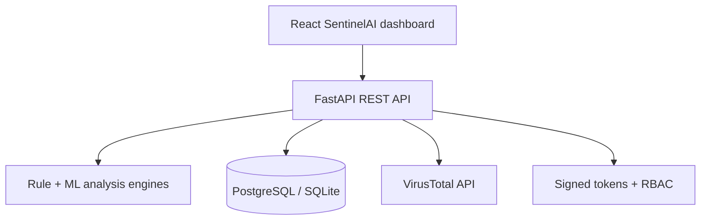

# AI Cyber Threat Intelligence Platform

An explainable full-stack cybersecurity platform for detecting suspicious URLs, phishing emails and network anomalies, managing incidents, and presenting actionable threat intelligence. It combines FastAPI, React, hybrid rule/ML scoring, PostgreSQL-ready persistence, RBAC, audit logs and optional VirusTotal enrichment.

## Current milestone

- URL normalization and validation
- Explainable phishing-risk scoring
- Detection of IP-based hosts, suspicious keywords, URL shorteners, punycode, excessive subdomains, unusual ports and insecure HTTP
- REST API with interactive Swagger documentation
- Responsive React dashboard with session statistics and scan history
- Persistent scan history and aggregate threat statistics using SQLite
- Configurable API URL for local and hosted environments
- Health endpoint
- Unit and API tests
- Docker and GitHub Actions support
- Secure registration and login with salted PBKDF2 password hashing
- Signed expiring access tokens and Viewer/Analyst/Admin role-based access
- Admin user-role console and persistent security audit trail
- PostgreSQL production persistence with automatic SQLite fallback for local development
- Reproducible logistic-regression URL classifier with saved model metadata
- Optional VirusTotal URL-reputation enrichment

## Architecture



## API

### Analyze a URL

`POST /api/v1/analyze-url`

```json
{
  "url": "http://secure-account-login.example.com/verify"
}
```

Example response:

```json
{
  "normalized_url": "http://secure-account-login.example.com/verify",
  "verdict": "suspicious",
  "risk_score": 55,
  "signals": [
    {
      "name": "insecure_protocol",
      "weight": 15,
      "description": "The URL uses HTTP instead of HTTPS."
    }
  ]
}
```

Other endpoints:

- `GET /` — service information
- `GET /api/v1/health` — health check
- `GET /api/v1/scans` — recent persisted scans
- `GET /api/v1/summary` — dashboard totals
- `POST /api/v1/auth/register` and `/auth/login` — account access
- `GET /api/v1/auth/me` — current authenticated user
- `GET /api/v1/users` and `PATCH /users/{id}/role` — Admin role management
- `GET /api/v1/audit-logs` — Admin security activity trail
- `POST /api/v1/threat-intelligence` — optional VirusTotal enrichment
- `POST/PATCH /api/v1/incidents` — Analyst/Admin case management
- `GET /api/v1/reports/incidents.csv` — Analyst/Admin report export
- `GET /docs` — Swagger UI

## Run locally

Start the API:

```bash
git clone https://github.com/ANKITJOSHI1605/AI-Cyber-Threat-Platform.git
cd AI-Cyber-Threat-Platform
python -m venv .venv
source .venv/bin/activate
pip install -r backend/requirements.txt
uvicorn backend.app.main:app --reload
```

In another terminal, start the dashboard:

```bash
cd frontend
npm install
npm run dev
```

Open [http://127.0.0.1:5173](http://127.0.0.1:5173). API documentation is available at [http://127.0.0.1:8000/docs](http://127.0.0.1:8000/docs).

For a hosted API, copy `frontend/.env.example` to `frontend/.env` and set `VITE_API_URL`.

Backend configuration:

| Variable | Purpose | Default |
| --- | --- | --- |
| `PORT` | Hosted web-service port | `8000` |
| `CORS_ORIGINS` | Comma-separated frontend URLs | Local Vite URLs |
| `DATABASE_PATH` | SQLite database file | `data/threat_scans.db` |
| `DATABASE_URL` | Render PostgreSQL connection URL; enables PostgreSQL automatically | None |
| `JWT_SECRET` | Stable secret used to sign access tokens | Random per process |
| `ADMIN_EMAIL` | Creates the initial administrator on startup | None |
| `ADMIN_PASSWORD` | Initial administrator password (10+ characters) | None |
| `TOKEN_TTL_SECONDS` | Access-token lifetime | `28800` |
| `VIRUSTOTAL_API_KEY` | Optional VirusTotal v3 API key | None |

In production, set a long random `JWT_SECRET`, `ADMIN_EMAIL`, and `ADMIN_PASSWORD` in the hosting provider. Never commit these values. New registrations always receive the read-only `viewer` role; an Admin can promote users through the API.

## Machine-learning model

The URL engine blends explainable security rules (70%) with a trained logistic-regression probability (30%). The committed model is reproducible:

```bash
python backend/ml/train_url_model.py
```

The included 20-row dataset is a small curated educational baseline, not a production benchmark. Replace it with a versioned public phishing dataset and report held-out precision, recall, F1 and ROC-AUC before claiming production accuracy.

## Tests

```bash
python -m pytest backend/tests -q
```

## Docker

```bash
docker build -t cyber-threat-api .
docker run -p 8000:8000 cyber-threat-api
```

## Roadmap

- [x] Explainable URL-risk engine
- [x] FastAPI endpoints and automated tests
- [x] Docker and continuous integration
- [x] Build React security dashboard
- [x] Persist scan history and dashboard statistics
- [x] Train and integrate an educational phishing URL classifier
- [x] Add PostgreSQL persistence with SQLite fallback
- [x] Add signed-token authentication and role-based access
- [ ] Integrate VirusTotal threat intelligence
- [x] Add network anomaly-detection module
- [x] Deploy frontend and API
- [x] Add optional VirusTotal reputation intelligence
- [ ] Evaluate the model on a large versioned public dataset

## Technology stack

React, Vite, Python, FastAPI, Pydantic, Pytest, Docker and GitHub Actions. Planned additions include scikit-learn/XGBoost and PostgreSQL.
